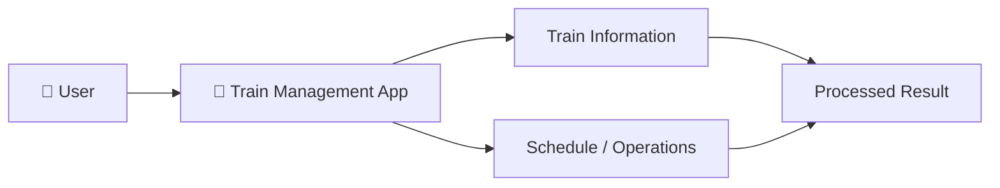
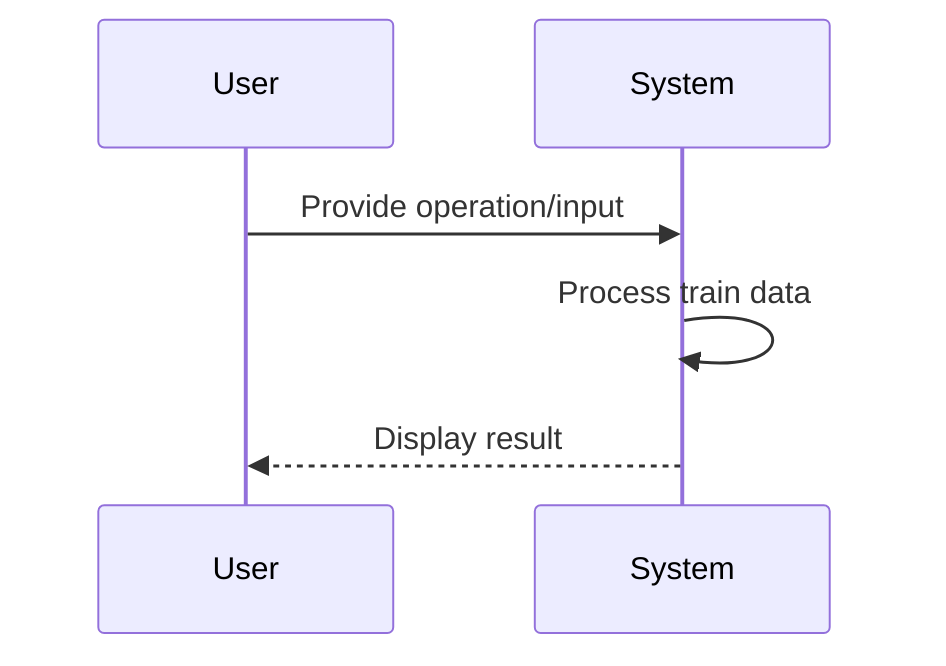
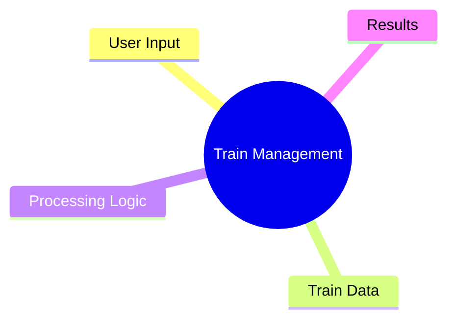

# 🚆 Train Consistent Management

> A Java project exploring train-management workflows and application logic.


## 🚦 System Flow


## 🧠 Application Workflow


## 🗺️ Project Blueprint


## 📂 Structure
```text
TrainConsistentManagement/
└── src/
```

## 🚀 Run
Compile and run the Java source from the `src` directory using your preferred Java IDE or the JDK command line tools.

---

### 👨‍💻 Created by **Priyanshu**
