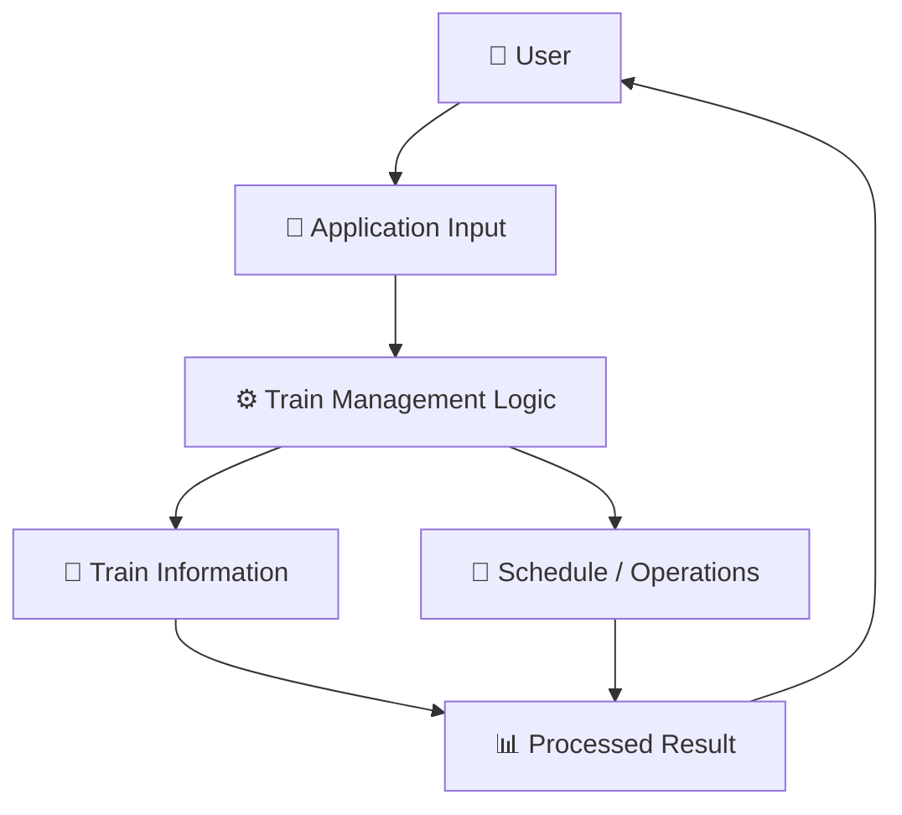
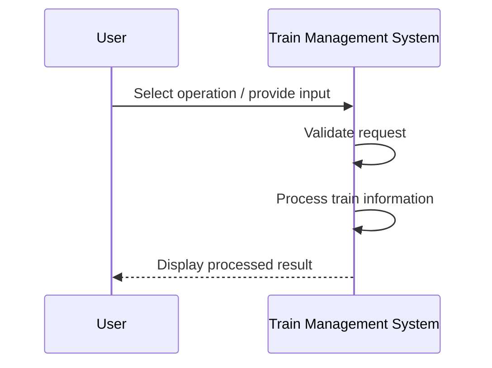
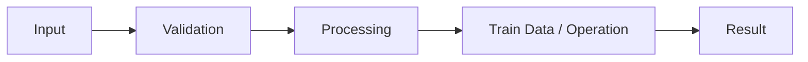
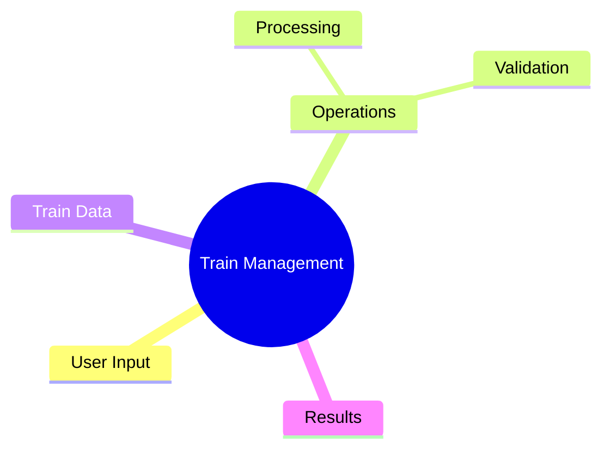

# 🚆 Train Consistent Management

<p align="center"><b>A Java project exploring train-management workflows, data handling, and application logic.</b></p>

<p align="center">


</p>

---

## 🚦 Overview

**Train Consistent Management** is a Java-based project centered around modelling train-related information and processing operations through an application workflow. It demonstrates how user requests can move through a structured system: **input → processing → result**.

## ✨ What It Covers

- 🚆 Train-related data handling
- 📝 User-driven operations
- ⚙️ Java processing logic
- 📊 Structured results
- 📚 Practice with application workflow design

## 🏗️ System Architecture



## 🔄 Application Flow



## 🧭 How the Workflow Fits Together

1. A user starts an operation and provides the required input.
2. The application receives and interprets that request.
3. Train-related information is processed through Java logic.
4. The system returns a structured result to the user.



## 📂 Project Structure

```text
TrainConsistentManagement/
├── src/
│   └── Java source files
└── README.md
```

## 🚀 Run Locally

### Requirements
- JDK installed

Compile the source file(s) inside `src/` and run the class containing the application entry point.

```bash
javac src/*.java
```

Then run the main class using your IDE or command line.

## 🧠 Project Map



## 💡 Learning Outcomes

This project is useful for understanding:

- Java program organization
- Input and output handling
- Structured application logic
- Domain-oriented problem modelling
- Breaking a workflow into manageable steps

## 🔮 Future Scope

- [ ] Add train search and filtering
- [ ] Add schedule management
- [ ] Store train information persistently
- [ ] Add booking or seat-management modules
- [ ] Build a GUI or web dashboard

---

### 👨‍💻 Created by **Priyanshu**

⭐ Star the repository if you like the project!
